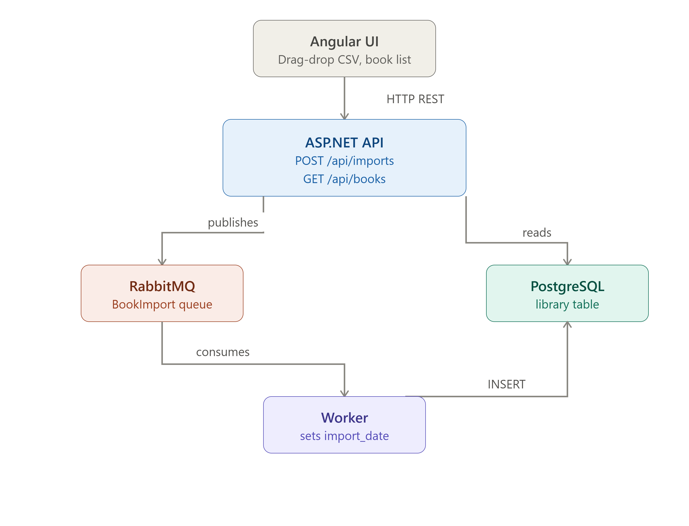

# Home Library

A simple book import application built with **.NET 10**, **Angular**, **PostgreSQL**, **RabbitMQ**, and **Docker Compose**.

The application follows an asynchronous producer-consumer architecture. The API parses uploaded CSV files and publishes one message per book to RabbitMQ. A dedicated background worker consumes these messages and persists the books in PostgreSQL.

This allows imports to be processed asynchronously while keeping the API responsive.

---

## Architecture



---

## Project Structure

```text
.
├── backend
│   ├── HomeLibrary.slnx
│   ├── HomeLibrary.Api
│   ├── HomeLibrary.Worker
│   ├── HomeLibrary.Shared
│   └── HomeLibrary.Tests
│
├── frontend
│   └── home-library-ui
│
├── docs
│   └── images
│       └── system-design.png
│
├── docker-compose.yml
├── .env.example
└── README.md
```

### Backend Projects

| Project | Description |
|----------|-------------|
| **HomeLibrary.Api** | REST API responsible for parsing CSV files, publishing messages to RabbitMQ, and exposing book endpoints. |
| **HomeLibrary.Worker** | Background worker responsible for consuming RabbitMQ messages and persisting books in PostgreSQL. |
| **HomeLibrary.Shared** | Shared entities, Entity Framework Core context, repositories, messaging contracts, and common models. |
| **HomeLibrary.Tests** | Unit tests covering the application's business logic. |

---

## Prerequisites

### Running the project locally

- .NET 10 SDK
- Node.js
- Docker Desktop

### Running the entire project with Docker

- Docker Desktop

---

## Configuration

Create a local `.env` file from the provided example.

### Windows PowerShell

```powershell
Copy-Item .env.example .env
```

### Linux / macOS

```bash
cp .env.example .env
```

The default values provided in `.env.example` are suitable for local development.

---

## Running with Docker

All Docker commands should be executed from the repository root:

```text
home-library-wa/
```

Build and start the complete application:

```bash
docker compose up -d --build
```

Stop all containers:

```bash
docker compose down
```

List running containers:

```bash
docker compose ps
```

View container logs:

```bash
docker compose logs -f
```

This starts:

- PostgreSQL
- RabbitMQ
- ASP.NET Core API
- Background Worker
- Angular frontend

---

## Running Locally

### Infrastructure

Start PostgreSQL and RabbitMQ:

```bash
docker compose up -d postgres rabbitmq
```

### Backend

Open the solution:

```text
backend/HomeLibrary.slnx
```

Run the following startup projects:

- `HomeLibrary.Api`
- `HomeLibrary.Worker`

### Frontend

From the repository root, run:

```bash
cd frontend/home-library-ui
npm install
npm start
```

---

## Entity Framework

Execute all Entity Framework commands from the `backend` folder:

```bash
cd backend
```

### Create a migration

```bash
dotnet ef migrations add <MigrationName> --project HomeLibrary.Shared --startup-project HomeLibrary.Api
```

### Apply migrations

```bash
dotnet ef database update --project HomeLibrary.Shared --startup-project HomeLibrary.Api
```

### Remove the last migration

```bash
dotnet ef migrations remove --project HomeLibrary.Shared --startup-project HomeLibrary.Api
```

---

## Running Tests

Execute all tests from the `backend` folder:

```bash
dotnet test
```

---

## Available Services

### Docker

| Service | URL |
|----------|-----|
| Angular UI | http://localhost:4200 |
| API | http://localhost:8080 |
| RabbitMQ Management | http://localhost:15672 |
| PostgreSQL | localhost:5432 |

### Local Development

When running the API locally, the OpenAPI specification is available at:

```text
https://localhost:7046/openapi/v1.json
```

The Angular frontend is available at:

```text
http://localhost:4200
```

---

## Default Credentials

### RabbitMQ

```text
Username: guest
Password: guest
```

### PostgreSQL

```text
Host=localhost
Port=5432
Database=library
Username=library
Password=library
```

---

## Technology Stack

- .NET 10
- ASP.NET Core Web API
- Entity Framework Core
- PostgreSQL
- RabbitMQ
- Angular
- Tailwind CSS (configured)
- Vanilla CSS
- Docker Compose
- xUnit
- Moq
